# Better Chatbot - AI 聊天机器人项目

## 变更记录 (Changelog)

- **2025-12-19**: 初始化 AI 上下文，生成项目架构文档
- **项目版本**: 1.26.0
- **技术栈**: Next.js 16.0.7, React 19, TypeScript, Drizzle ORM, PostgreSQL

## 项目愿景

Better Chatbot 是一个开源的 AI 聊天机器人平台，集成了多个主流 LLM 提供商，支持 MCP (Model Context Protocol) 协议、自定义代理、工作流自动化、语音助手等功能。项目旨在为个人和团队提供强大且可定制的 AI 助手体验。

## 架构总览

### 核心技术栈
- **前端框架**: Next.js 16 (App Router)
- **UI 组件**: Radix UI + Tailwind CSS
- **状态管理**: Zustand
- **数据库**: PostgreSQL + Drizzle ORM
- **认证**: Better Auth
- **AI SDK**: Vercel AI SDK
- **国际化**: next-intl
- **工具集成**: Model Context Protocol (MCP)

### 项目特性
- ✨ **多 AI 提供商支持**: OpenAI, Anthropic, Google, xAI, Ollama, Groq 等
- 🛠️ **MCP 协议支持**: 集成外部工具和服务
- 🤖 **自定义代理**: 创建专门的 AI 助手
- 🔗 **可视化工作流**: 拖拽式工作流编辑器
- 🎙️ **语音助手**: 实时语音聊天
- 📊 **数据可视化**: 图表生成和交互式表格
- 🌐 **多语言支持**: 国际化支持
- 👥 **用户管理**: 权限控制和团队协作
- 📁 **文件存储**: Vercel Blob/S3 集成

## 模块结构图

```mermaid
graph TD
    A["(根) Better Chatbot"] --> B["src/app"];
    A --> C["src/components"];
    A --> D["src/lib"];
    A --> E["src/types"];
    A --> F["tests"];
    A --> G["docs"];
    A --> H["scripts"];

    B --> B1["(auth) 认证模块"];
    B --> B2["(chat) 聊天核心"];
    B --> B3["(public) 公开页面"];
    B --> B4["api API 路由"];

    B2 --> B2a["agents 代理管理"];
    B2 --> B2b["workflow 工作流"];
    B2 --> B2c["mcp MCP管理"];
    B2 --> B2d["archive 归档"];

    C --> C1["chat 聊天组件"];
    C --> C2["agent 代理组件"];
    C --> C3["workflow 工作流组件"];
    C --> C4["mcp MCP组件"];
    C --> C5["layouts 布局组件"];
    C --> C6["ui 基础组件"];

    D --> D1["ai AI核心"];
    D --> D2["auth 认证逻辑"];
    D --> D3["db 数据库"];
    D --> D4["cache 缓存"];
    D --> D5["code-runner 代码执行"];

    D1 --> D1a["models 模型管理"];
    D1 --> D1b["tools 工具集成"];
    D1 --> D1c["mcp MCP客户端"];
    D1 --> D1d["workflow 工作流引擎"];

    click B1 "./src/app/(auth)/CLAUDE.md" "查看认证模块文档"
    click B2 "./src/app/(chat)/CLAUDE.md" "查看聊天核心文档"
    click C1 "./src/components/chat/CLAUDE.md" "查看聊天组件文档"
    click D1 "./src/lib/ai/CLAUDE.md" "查看AI核心文档"
    click D3 "./src/lib/db/CLAUDE.md" "查看数据库文档"
```



## 模块索引

| 模块路径 | 职责描述 | 技术栈 | 入口文件 |
|---------|---------|--------|----------|
| `src/app/(auth)` | 用户认证系统 | Better Auth | `layout.tsx` |
| `src/app/(chat)` | 聊天应用核心 | Next.js, React | `page.tsx` |
| `src/components/chat` | 聊天界面组件 | React, Tailwind | `chat-bot.tsx` |
| `src/lib/ai` | AI 核心功能 | AI SDK, MCP | `models.ts` |
| `src/lib/auth` | 认证业务逻辑 | Better Auth | `config.ts` |
| `src/lib/db` | 数据库操作 | Drizzle ORM | `schema.pg.ts` |
| `src/lib/ai/tools` | 内置工具集 | TypeScript | `index.ts` |
| `src/lib/ai/workflow` | 工作流引擎 | TypeScript | `executor/` |
| `tests` | 端到端测试 | Playwright | `*.spec.ts` |

## 运行与开发

### 环境要求
- Node.js >= 18
- PostgreSQL
- pnpm (推荐)

### 快速启动

```bash
# 安装依赖
pnpm i

# 配置环境变量（.env 文件会在安装时自动生成）
# 至少需要一个 LLM 提供商的 API Key

# 启动开发服务器
pnpm dev

# 或使用 Docker Compose（包含数据库）
pnpm docker-compose:up
```

### 主要脚本命令

```bash
# 开发相关
pnpm dev              # 开发服务器
pnpm build            # 生产构建
pnpm start            # 启动生产服务器

# 数据库操作
pnpm db:generate      # 生成迁移文件
pnpm db:push          # 推送 schema 到数据库
pnpm db:studio        # 打开 Drizzle Studio

# 测试
pnpm test             # 单元测试
pnpm test:e2e         # 端到端测试
pnpm test:e2e:ui      # Playwright UI

# 代码质量
pnpm lint             # 代码检查
pnpm format           # 代码格式化
pnpm check-types      # 类型检查
```

## 测试策略

### 测试层级
1. **单元测试** (Vitest)
   - 核心工具函数测试
   - 数据库操作测试
   - AI 工具测试

2. **集成测试**
   - API 端点测试
   - MCP 连接测试
   - 认证流程测试

3. **端到端测试** (Playwright)
   - 用户完整流程测试
   - 多用户场景测试
   - 权限控制测试

### 测试文件结构
```
tests/
├── admin/           # 管理员功能测试
├── agents/          # 代理功能测试
├── auth/            # 认证测试
├── permissions/     # 权限测试
├── user/            # 用户功能测试
├── models/          # 模型选择测试
├── helpers/         # 测试辅助函数
└── lifecycle/       # 测试生命周期管理
```

## 编码规范

### TypeScript 配置
- 严格模式启用
- 路径别名配置：
  - `ui/*` → `./src/components/ui/*`
  - `auth/*` → `./src/lib/auth/*`
  - `lib/*` → `./src/lib/*`
  - `@/*` → `./src/*`

### 代码风格
- 使用 **Biome** 进行代码格式化和检查
- 组件使用 **PascalCase** 命名
- 文件名使用 **kebab-case**
- 接口以 `I` 开头，类型以 `T` 开头（可选）

### 提交规范
遵循约定式提交（Conventional Commits）：
- `feat:` 新功能
- `fix:` 修复 bug
- `refactor:` 重构
- `test:` 测试相关
- `docs:` 文档更新
- `chore:` 构建工具、辅助工具变动

## AI 使用指引

### 项目结构理解
1. **认证模块** (`src/app/(auth)`)：处理用户登录、注册
2. **聊天核心** (`src/app/(chat)`)：主要的聊天功能
3. **AI 集成** (`src/lib/ai`)：模型管理和工具集成
4. **数据库** (`src/lib/db`)：数据持久化
5. **组件库** (`src/components/ui`)：可复用组件

### 常见任务
1. **添加新的 AI 提供商**：修改 `src/lib/ai/models.ts`
2. **创建新工具**：在 `src/lib/ai/tools/` 添加工具文件
3. **添加新页面**：在 `src/app/` 相应目录添加路由
4. **数据库迁移**：修改 schema 后运行 `pnpm db:generate`
5. **添加测试**：在 `tests/` 相应目录添加测试文件

### 重要注意事项
- 所有 API 路由都在 `src/app/api/` 目录
- 环境变量配置参考 `.env.example`
- MCP 服务器配置支持数据库和文件两种模式
- 使用 SWR 进行客户端数据获取
- 国际化文件在 `messages/` 目录

## 相关链接
- [项目 README](./README.md)
- [贡献指南](./CONTRIBUTING.md)
- [变更日志](./CHANGELOG.md)
- [Docker 部署指南](./docs/tips-guides/docker.md)
- [Vercel 部署指南](./docs/tips-guides/vercel.md)
- [MCP 服务器设置](./docs/tips-guides/mcp-server-setup-and-tool-testing.md)

# Rules Must Follow
若有任何代码文件变更，请及时更新对应文件夹下的 CLAUDE.md 文档，以确保文档内容与实际代码保持一致。
