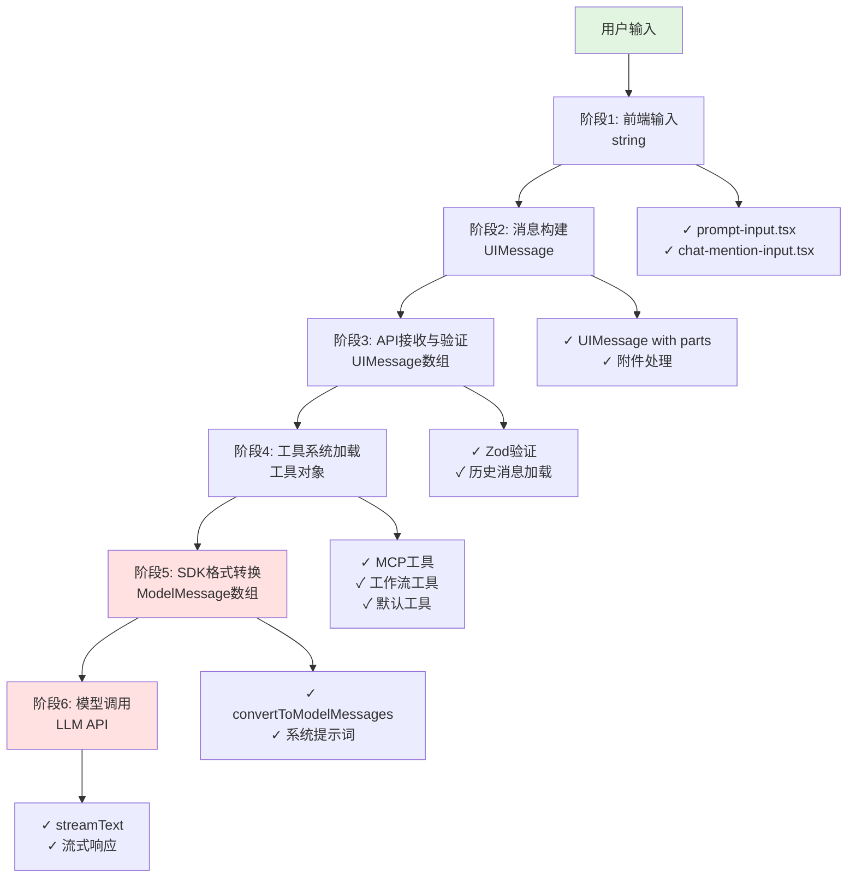
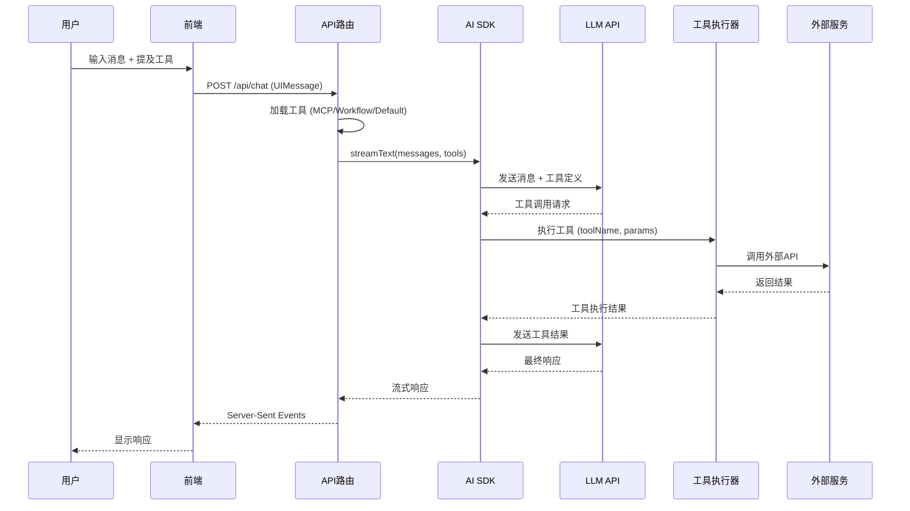

# 消息数据流转全链路分析

## 概述

本文档详细说明了消息从前端用户输入到发送给 LLM API 的完整数据流转过程，包括每个阶段的数据类型转换、关键代码路径和实现细节。

## 数据流转概览



---

## 阶段 1: 前端用户输入

### 数据类型
- **输入类型**: `string` (原始字符串)
- **状态类型**:
  - `input: string` - 用户输入的文本
  - `mentions: ChatMention[]` - 提及的组件
  - `uploadedFiles: UploadedFile[]` - 上传的文件

### 关键组件

#### 1.1 输入框容器
**文件**: [src/components/prompt-input.tsx](../../src/components/prompt-input.tsx)

**状态管理**:
```typescript
// 用户输入文本状态
const [input, setInput] = useState<string>("");

// 提及组件状态
const [mentions, setMentions] = useState<ChatMention[]>([]);

// 上传文件状态
const [uploadedFiles, setUploadedFiles] = useState<UploadedFile[]>([]);
```

#### 1.2 富文本编辑器
**文件**: [src/components/mention-input.tsx](../../src/components/mention-input.tsx)

基于 TipTap 的编辑器，支持：
- 纯文本输入
- 语法高亮
- @ 提及建议

**输入处理**:
```typescript
// prompt-input.tsx:64-79
const handleChange = useCallback(
  ({ text, mentions }: { text: string; mentions: { label: string; id: string }[] }) => {
    onChange(text); // 更新文本输入
    const mentionsIds = mentions.map((mention) => mention.id);
    const parsedMentions = mentionsIds.map((id) =>
      JSON.parse(id) as ChatMention
    );
    onChangeMention(parsedMentions);
  },
  [onChange, onChangeMention]
);
```

#### 1.3 提及系统
**文件**: [src/components/chat-mention-input.tsx](../../src/components/chat-mention-input.tsx)

支持的提及类型：
```typescript
type ChatMention =
  | { type: "agent"; name: string; id: string }
  | { type: "workflow"; name: string; id: string }
  | { type: "mcpServer"; name: string; id: string }
  | { type: "mcpTool"; name: string; id: string; serverName: string }
  | { type: "defaultTool"; name: string; id: string };
```

---

## 阶段 2: 消息构建

### 数据类型
- **目标类型**: `UIMessage` (Vercel AI SDK 类型)
- **位置**: [src/types/chat.ts](../../src/types/chat.ts)

### UIMessage 结构

```typescript
// 来自 Vercel AI SDK (ai package)
interface UIMessage {
  id: string;
  role: "user" | "assistant" | "system";
  parts: UIMessagePart[];
  metadata?: ChatMetadata;
}

// 消息部分类型
type UIMessagePart =
  | TextPart              // { type: "text", text: string }
  | FileUIPart            // { type: "file", url: string, mediaType: string, filename: string }
  | ToolCallPart          // 工具调用
  | ToolResultPart;       // 工具结果
```

### 消息构建流程

**文件**: [src/components/prompt-input.tsx:324-387](../../src/components/prompt-input.tsx#L324-L387)

```typescript
const submit = () => {
  if (isLoading) return;

  // 验证文件上传状态
  if (uploadedFiles.some((file) => file.isUploading)) {
    toast.error("Please wait for files to finish uploading before sending.");
    return;
  }

  const userMessage = input?.trim() || "";
  if (userMessage.length === 0) return;

  // 清空输入
  setInput("");

  // STEP 1: 构建附件部分
  // TYPE-CONVERSION: UploadedFile[] → FileUIPart[]
  const attachmentParts = uploadedFiles.reduce<Array<FileUIPart | TextUIPart>>(
    (acc, file) => {
      if (file.url) {
        return [
          ...acc,
          {
            type: "file",
            url: file.url,
            mediaType: file.mimeType,
            filename: file.name,
          } as FileUIPart,
        ];
      }
      return acc;
    },
    []
  );

  // STEP 2: 构建完整消息
  // TYPE-CONVERSION: string + FileUIPart[] → UIMessage
  const message: UIMessage = {
    role: "user",
    parts: [
      ...attachmentParts,
      { type: "text", text: userMessage }
    ]
  };

  // STEP 3: 发送到后端API
  sendMessage(message);

  // 清空已上传文件
  setUploadedFiles([]);
};
```

### 数据转换示例

**输入**:
```typescript
input = "分析这个图表"
uploadedFiles = [
  { url: "https://...", name: "chart.png", mimeType: "image/png" }
]
```

**输出 (UIMessage)**:
```json
{
  "role": "user",
  "parts": [
    {
      "type": "file",
      "url": "https://...",
      "mediaType": "image/png",
      "filename": "chart.png"
    },
    {
      "type": "text",
      "text": "分析这个图表"
    }
  ]
}
```

---

## 阶段 3: API 接收与验证

### 数据类型
- **输入**: JSON 请求体
- **输出**: 验证后的 `UIMessage[]` 和配置对象

### API 路由

**文件**: [src/app/api/chat/route.ts](../../src/app/api/chat/route.ts)

#### 3.1 请求体 Schema

**文件**: [src/types/chat.ts](../../src/types/chat.ts)

```typescript
export const chatApiSchemaRequestBodySchema = z.object({
  id: z.string(),                    // 聊天线程ID
  message: z.any() as z.ZodType<UIMessage>, // 用户消息
  chatModel: z.object({              // AI模型配置
    provider: z.string(),
    model: z.string(),
  }).optional(),
  toolChoice: z.enum(["auto", "none", "manual"]).optional(),
  mentions: z.array(ChatMentionSchema).optional(),
  imageTool: z.object({
    model: z.string().optional(),
  }).optional(),
  allowedMcpServers: z.record(
    z.string(),
    AllowedMCPServerZodSchema
  ).optional(),
  allowedAppDefaultToolkit: z.array(z.string()).optional(),
  attachments: z.array(ChatAttachmentSchema).optional(),
});
```

#### 3.2 API 处理流程

**文件**: [src/app/api/chat/route.ts:67-217](../../src/app/api/chat/route.ts#L67-L217)

```typescript
export async function POST(request: Request) {
  // STEP 1: 初始化 Langfuse 追踪
  ensureLangfuse();

  // STEP 2: 解析 JSON 请求体
  const json = await request.json();

  // STEP 3: 身份验证
  const session = await getSession();
  if (!session?.user.id) {
    return new Response("Unauthorized", { status: 401 });
  }

  // STEP 4: Zod 验证请求数据
  // TYPE-CONVERSION: JSON → TypeScript 对象
  const {
    id,                  // 线程ID
    message,             // UIMessage
    chatModel,           // 模型配置
    toolChoice,          // 工具选择策略
    mentions,            // ChatMention[]
    attachments,         // 附件列表
    imageTool,           // 图像工具配置
    allowedMcpServers,   // 允许的MCP服务器
    allowedAppDefaultToolkit, // 允许的默认工具
  } = chatApiSchemaRequestBodySchema.parse(json);

  // STEP 5: 获取AI模型实例
  const model = customModelProvider.getModel(chatModel);

  // STEP 6: 获取或创建聊天线程
  let thread = await chatRepository.selectThreadDetails(id);
  if (!thread) {
    const newThread = await chatRepository.insertThread({
      id,
      title: "",
      userId: session.user.id,
    });
    thread = newThread;
  }

  // STEP 7: 加载历史消息
  // TYPE-CONVERSION: Database Message[] → UIMessage[]
  const messages: UIMessage[] = (thread?.messages ?? []).map((m) => ({
    id: m.id,
    role: m.role,
    parts: m.parts,
    metadata: m.metadata,
  }));

  // STEP 8: 添加新消息
  messages.push(message);

  // STEP 9: 处理 CSV 附件
  const ingestionPreviewParts = await buildCsvIngestionPreviewParts(
    attachments,
    (key) => serverFileStorage.download(key),
  );

  // STEP 10: 创建数据流（用于流式响应）
  const dataStream = createDataStream();

  // STEP 11: 构建系统提示词（详见阶段4）
  const systemPrompt = buildUserSystemPrompt(
    session.user,
    userPreferences,
    agent
  );

  // ... 继续阶段4和5
}
```

### 关键数据结构

#### 3.3 消息历史加载

```typescript
// 数据库中的消息格式
interface DBMessage {
  id: string;
  role: "user" | "assistant";
  parts: UIMessagePart[];
  metadata?: ChatMetadata;
  createdAt: Date;
}

// 转换为 SDK 格式
const messages: UIMessage[] = thread.messages.map((m) => ({
  id: m.id,
  role: m.role,
  parts: m.parts,
  metadata: m.metadata,
}));
```

---

## 阶段 4: 工具系统加载

### 数据类型
- **目标类型**: `Record<string, Tool>` (Vercel AI SDK 工具格式)

### 工具加载流程

**文件**: [src/app/api/chat/route.ts:152-182](../../src/app/api/chat/route.ts#L152-L182)

```typescript
// STEP 1: 加载 MCP 工具（外部服务集成）
// TYPE-CONVERSION: MCPServer[] → Record<string, Tool>
const MCP_TOOLS = await loadMcpTools({
  mentions,
  allowedMcpServers,
});

// STEP 2: 加载工作流工具（自定义工作流）
// TYPE-CONVERSION: Workflow[] → Record<string, Tool>
const WORKFLOW_TOOLS = await loadWorkFlowTools({
  mentions,
  dataStream,
});

// STEP 3: 加载默认工具（内置功能）
// TYPE-CONVERSION: AppDefaultToolkit → Record<string, Tool>
const APP_DEFAULT_TOOLS = await loadAppDefaultTools({
  mentions,
  allowedAppDefaultToolkit,
});

// STEP 4: 加载图像工具（可选）
const IMAGE_TOOL: Record<string, Tool> = useImageTool ? {
  [ImageToolName]: imageTool?.model === "google"
    ? nanoBananaTool
    : openaiImageTool,
} : {};

// STEP 5: 合并所有工具
const vercelAITools: Record<string, Tool> = {
  ...MCP_TOOLS,
  ...WORKFLOW_TOOLS,
  ...APP_DEFAULT_TOOLS,
  ...IMAGE_TOOL,
};
```

### 4.1 工具类型定义

```typescript
// Vercel AI SDK 工具格式
type Tool<TInput extends z.ZodTypeAny = z.ZodTypeAny> = {
  description: string;
  inputSchema: TInput;
  execute: (params: z.infer<TInput>) => Promise<any>;
};
```

### 4.2 工具加载器详细说明

#### MCP 工具加载
**文件**: [src/app/api/chat/shared.chat.ts](../../src/app/api/chat/shared.chat.ts)

```typescript
export const loadMcpTools = (opt?: {
  mentions?: ChatMention[];
  allowedMcpServers?: Record<string, AllowedMCPServer>;
}) =>
  safe(() => mcpClientsManager.tools())
    .map((tools) => {
      // 根据提及过滤工具
      if (opt?.mentions?.length) {
        return filterMCPToolsByMentions(tools, opt.mentions);
      }
      // 根据允许的服务器过滤工具
      return filterMCPToolsByAllowedMCPServers(tools, opt?.allowedMcpServers);
    })
    .orElse({} as Record<string, VercelAIMcpTool>);
```

#### 默认工具集
**文件**: [src/lib/ai/tools/tool-kit.ts](../../src/lib/ai/tools/tool-kit.ts)

```typescript
export const APP_DEFAULT_TOOL_KIT: Record<
  AppDefaultToolkit,
  Record<string, Tool>
> = {
  // 数据可视化工具
  [AppDefaultToolkit.Visualization]: {
    [DefaultToolName.CreatePieChart]: createPieChartTool,
    [DefaultToolName.CreateBarChart]: createBarChartTool,
    [DefaultToolName.CreateLineChart]: createLineChartTool,
    [DefaultToolName.CreateTable]: createTableTool,
  },

  // 网络搜索工具
  [AppDefaultToolkit.WebSearch]: {
    [DefaultToolName.WebSearch]: exaSearchTool,
    [DefaultToolName.WebContent]: exaContentsTool,
  },

  // HTTP 请求工具
  [AppDefaultToolkit.Http]: {
    [DefaultToolName.Http]: httpFetchTool,
  },

  // 代码执行工具
  [AppDefaultToolkit.Code]: {
    [DefaultToolName.JavascriptExecution]: jsExecutionTool,
    [DefaultToolName.PythonExecution]: pythonExecutionTool,
  },
};
```

### 4.3 工具实现示例

**文件**: [src/lib/ai/tools/web/web-search.ts](../../src/lib/ai/tools/web/web-search.ts)

```typescript
export const exaSearchTool = createTool({
  id: "exa_search",
  description: "Search the web using Exa AI",
  inputSchema: jsonSchemaToZod(exaSearchSchema),

  execute: (params) => {
    return safe(async () => {
      // 构建搜索请求
      const searchRequest: ExaSearchRequest = {
        query: params.query,
        type: params.type || "auto",
        numResults: params.numResults || 5,
        contents: {
          text: { maxCharacters: params.maxCharacters || 3000 },
          livecrawl: "preferred",
        },
      };

      // 执行 API 调用
      const result = await fetchExa("/search", searchRequest);
      return result;
    })
    .ifFail((e) => ({
      isError: true,
      error: e.message,
      content: "Search failed. Please try again.",
    }))
    .unwrap();
  },
});
```

---

## 阶段 5: 模型调用 (SDK 格式转换)

### 数据类型
- **输入**: `UIMessage[]` + `Record<string, Tool>` + `string` (系统提示词)
- **输出**: `ModelMessage[]` (LLM API 标准格式)

### 5.1 系统提示词构建

**文件**: [src/lib/ai/prompts.ts](../../src/lib/ai/prompts.ts)

```typescript
export const buildUserSystemPrompt = (
  user?: User,
  userPreferences?: UserPreferences,
  agent?: Agent,
) => {
  let prompt = `You are ${assistantName}`;

  // 添加代理角色
  if (agent?.instructions?.role) {
    prompt += `. You are an expert in ${agent.instructions.role}`;
  }

  // 添加代理指令
  if (agent?.instructions?.systemPrompt) {
    prompt += `
<core_capabilities>
${agent.instructions.systemPrompt}
</core_capabilities>`;
  }

  // 添加用户信息
  const userInfo = [];
  if (user?.name) {
    userInfo.push(`Name: ${user.name}`);
  }
  if (userPreferences) {
    // ... 添加用户偏好
  }

  if (userInfo.length > 0) {
    prompt += `
<user_information>
${userInfo.join("\n")}
</user_information>`;
  }

  return prompt;
};
```

### 5.2 核心：消息格式转换

**关键函数**: `convertToModelMessages()`
**来源**: Vercel AI SDK (`ai` 包)

```typescript
// 文件: src/app/api/chat/route.ts:195-217
import { convertToModelMessages, streamText } from "ai";

const result = streamText({
  model: model,                              // LanguageModel 实例
  system: systemPrompt,                      // 系统提示词字符串
  messages: convertToModelMessages(messages), // 关键转换点
  tools: vercelAITools,                       // 工具集合
  toolChoice: "auto",
  maxRetries: 2,
  experimental_transform: smoothStream({ chunking: "word" }),
  experimental_telemetry: {
    isEnabled: true,  // 发送遥测数据到 Langfuse
  },
});
```

### 5.3 转换示例

#### 输入 (UIMessage 格式)
```typescript
const messages: UIMessage[] = [
  {
    id: "msg-1",
    role: "user",
    parts: [
      { type: "text", text: "Hello, how are you?" },
      {
        type: "file",
        url: "https://example.com/image.jpg",
        mediaType: "image/jpeg",
        filename: "image.jpg"
      }
    ]
  },
  {
    id: "msg-2",
    role: "assistant",
    parts: [
      { type: "text", text: "I'm doing well, thank you!" }
    ]
  }
];
```

#### 输出 (ModelMessage 格式)
```typescript
const modelMessages = convertToModelMessages(messages);
// 结果:
[
  {
    role: "user",
    content: [
      { type: "text", text: "Hello, how are you?" },
      { type: "image", url: "https://example.com/image.jpg" }
    ]
  },
  {
    role: "assistant",
    content: [
      { type: "text", text: "I'm doing well, thank you!" }
    ]
  }
]
```

### 5.4 差异说明

| 特性 | UIMessage | ModelMessage |
|-----|-----------|--------------|
| `id` 字段 | ✅ 必需 | ❌ 移除 |
| `parts` 数组 | ✅ 使用 | ❌ 转换为 `content` |
| `content` 字段 | ❌ 不使用 | ✅ 使用 |
| 文件类型 | `file` | `image`/`text` 等 |
| 工具调用 | `ToolCallPart` | 标准化的工具调用格式 |
| 元数据 | ✅ `metadata` | ❌ 不包含 |

### 5.5 流式响应处理

```typescript
// 消费流式响应
result.consumeStream();

// 合并数据流
dataStream.merge(
  result.toUIMessageStream({
    messageMetadata: ({ part }) => {
      if (part.type == "finish") {
        metadata.usage = part.totalUsage;
        return metadata;
      }
    },
  })
);

// 返回响应
return new Response(dataStream.value, {
  headers: {
    "Content-Type": "text/event-stream",
    "Cache-Control": "no-cache",
    Connection: "keep-alive",
  },
});
```

---

## 数据类型转换对照表

| 阶段 | 数据类型 | TypeScript 类型 | 位置 | 格式 |
|-----|---------|----------------|------|------|
| 1️⃣ 用户输入 | 原始字符串 | `string` | 输入框 | `"Hello world"` |
| 1️⃣ 附加数据 | 提及组件 | `ChatMention[]` | 状态 | `[{type: "agent", name: "..."}]` |
| 1️⃣ 附加数据 | 上传文件 | `UploadedFile[]` | 状态 | `[{url: "...", name: "..."}]` |
| 2️⃣ 消息构建 | UI 消息 | `UIMessage` | 前端组件 | `{role, parts: []}` |
| 2️⃣ 消息部分 | 文本部分 | `TextPart` | UIMessage.parts | `{type: "text", text: "..."}` |
| 2️⃣ 消息部分 | 文件部分 | `FileUIPart` | UIMessage.parts | `{type: "file", url: "..."}` |
| 3️⃣ API 传输 | 请求体 | `z.infer<typeof chatApiSchemaRequestBodySchema>` | HTTP JSON | `{id, message, chatModel, ...}` |
| 3️⃣ 后端处理 | 消息数组 | `UIMessage[]` | API 路由 | `[{role, parts}, ...]` |
| 4️⃣ 工具加载 | 工具集合 | `Record<string, Tool>` | 服务层 | `{toolName: {description, ...}}` |
| 5️⃣ SDK 转换 | 模型消息 | `ModelMessage[]` | AI SDK 内部 | `[{role, content}, ...]` |
| 6️⃣ LLM API | 提供商格式 | Provider-specific | HTTP JSON | OpenAI/Anthropic/... |

---

## 工具调用流程

### 工具调用生命周期



### 工具调用数据流

```typescript
// 1. LLM 请求工具调用
{
  role: "assistant",
  content: [
    {
      type: "tool-call",
      toolName: "web_search",
      toolCallId: "call_123",
      args: { query: "TypeScript tutorial" }
    }
  ]
}

// 2. AI SDK 执行工具
const result = await vercelAITools["web_search"].execute({
  query: "TypeScript tutorial"
});

// 3. 工具返回结果
{
  type: "tool-result",
  toolCallId: "call_123",
  toolName: "web_search",
  result: {
    results: [
      { title: "...", url: "...", content: "..." }
    ]
  }
}

// 4. 发送回 LLM
{
  role: "user",
  content: [
    {
      type: "tool-result",
      toolCallId: "call_123",
      result: { ... }
    }
  ]
}

// 5. LLM 生成最终响应
{
  role: "assistant",
  content: [
    { type: "text", text: "I found some resources..." }
  ]
}
```

---

## 关键文件索引

### 前端组件
| 文件 | 职责 | 关键函数 |
|-----|------|----------|
| [src/components/prompt-input.tsx](../../src/components/prompt-input.tsx) | 输入框主容器 | `submit()` |
| [src/components/chat-mention-input.tsx](../../src/components/chat-mention-input.tsx) | @提及功能 | `handleMentionSelect()` |
| [src/components/mention-input.tsx](../../src/components/mention-input.tsx) | TipTap编辑器 | `handleChange()` |
| [src/components/chat/chat-bot.tsx](../../src/components/chat/chat-bot.tsx) | 聊天主组件 | `useChat()` hook |

### 后端 API
| 文件 | 职责 | 关键函数 |
|-----|------|----------|
| [src/app/api/chat/route.ts](../../src/app/api/chat/route.ts) | 主API入口 | `POST()` |
| [src/app/api/chat/shared.chat.ts](../../src/app/api/chat/shared.chat.ts) | 共享处理逻辑 | `loadMcpTools()` 等 |
| [src/app/api/chat/temporary/route.ts](../../src/app/api/chat/temporary/route.ts) | 临时聊天API | `POST()` |

### AI 核心
| 文件 | 职责 | 关键函数 |
|-----|------|----------|
| [src/lib/ai/models.ts](../../src/lib/ai/models.ts) | 模型管理 | `getModel()` |
| [src/lib/ai/prompts.ts](../../src/lib/ai/prompts.ts) | 提示词构建 | `buildUserSystemPrompt()` |
| [src/lib/ai/tools/tool-kit.ts](../../src/lib/ai/tools/tool-kit.ts) | 工具集合 | `APP_DEFAULT_TOOL_KIT` |
| [src/lib/ai/mcp/](../../src/lib/ai/mcp/) | MCP 集成 | `mcpClientsManager` |
| [src/lib/ai/workflow/](../../src/lib/ai/workflow/) | 工作流引擎 | 工作流执行器 |

### 类型定义
| 文件 | 职责 | 关键类型 |
|-----|------|----------|
| [src/types/chat.ts](../../src/types/chat.ts) | 聊天类型 | `UIMessage`, `ChatMention` |
| [src/types/agent.ts](../../src/types/agent.ts) | 代理类型 | `Agent` |
| [src/types/mcp.ts](../../src/types/mcp.ts) | MCP 类型 | `MCPServer` |

---

## 扩展指南

### 添加新的消息类型

1. **定义新的 UI Message Part**:
```typescript
// src/types/chat.ts
interface CustomPart {
  type: "custom";
  data: any;
}
```

2. **在前端构建消息**:
```typescript
const message: UIMessage = {
  role: "user",
  parts: [
    { type: "custom", data: { ... } }
  ]
};
```

3. **在 API 处理**:
```typescript
// src/app/api/chat/route.ts
const processedMessages = messages.map(msg => ({
  ...msg,
  parts: msg.parts.map(part => {
    if (part.type === "custom") {
      // 自定义处理逻辑
      return transformCustomPart(part);
    }
    return part;
  })
}));
```

### 添加新工具

1. **定义工具 Schema**:
```typescript
// src/lib/ai/tools/my-tool.ts
const myToolSchema = {
  type: "object",
  properties: {
    param1: { type: "string" },
    param2: { type: "number" }
  },
  required: ["param1"]
};
```

2. **创建工具**:
```typescript
import { createTool } from "ai";
import { jsonSchemaToZod } from "@/lib/utils/json-schema";

export const myTool = createTool({
  description: "Tool description",
  inputSchema: jsonSchemaToZod(myToolSchema),
  execute: async (params) => {
    // 工具实现
    return { result: "..." };
  },
});
```

3. **注册工具**:
```typescript
// src/lib/ai/tools/tool-kit.ts
export const APP_DEFAULT_TOOL_KIT = {
  [AppDefaultToolkit.Custom]: {
    [DefaultToolName.MyTool]: myTool,
  },
};
```

### 添加新的 AI 提供商

1. **定义模型**:
```typescript
// src/lib/ai/models.ts
import { createOpenAI } from "ai";

const customProvider = createOpenAI({
  name: "custom",
  apiKey: process.env.CUSTOM_API_KEY,
});

const customModels = {
  "model-1": customProvider("model-1"),
  "model-2": customProvider("model-2"),
};
```

2. **注册提供商**:
```typescript
export const allModels = {
  custom: customModels,
  // ... 其他提供商
};
```

---

## 监控与调试

### Langfuse 追踪

```typescript
// 设置追踪
updateActiveTrace({
  name: "chat-request",
  sessionId: threadId,
  userId: session.user.id,
  metadata: {
    chatModel: `${chatModel?.provider}/${chatModel?.model}`,
    agentId: agent?.id,
    toolChoice,
  },
});

// 观测输入
updateActiveObservation({
  input: inputText,
});
```

### Sentry 错误捕获

```typescript
import * as Sentry from "@sentry/nextjs";

try {
  // API 逻辑
} catch (error) {
  Sentry.captureException(error);
  return new Response("Internal Server Error", { status: 500 });
}
```

---

## 常见问题

### Q1: 为什么需要 `convertToModelMessages`?

**A**: Vercel AI SDK 使用两种消息格式：
- **UIMessage**: 用于前端显示和存储，包含更多元数据（如 `id`、`metadata`）
- **ModelMessage**: 用于 LLM API 调用，符合 OpenAI/Anthropic 等标准

`convertToModelMessages` 负责将前者转换为后者。

### Q2: 工具调用是如何实现的?

**A**: 工具调用流程：
1. AI SDK 将工具定义发送给 LLM
2. LLM 决定是否需要使用工具
3. 如果需要，LLM 返回工具调用请求
4. AI SDK 执行对应的 `execute` 函数
5. 工具结果作为新的消息发送回 LLM
6. LLM 基于工具结果生成最终响应

### Q3: 如何调试消息流转?

**A**: 在关键点添加日志：
```typescript
// 前端
console.log("提交消息:", message);

// API
console.log("接收到的消息:", message);
console.log("加载的工具:", Object.keys(vercelAITools));

// AI SDK
experimental_telemetry: {
  isEnabled: true,  // Langfuse 追踪
}
```

---

## 相关文档

- [项目主文档](../../CLAUDE.md)
- [AI 核心模块](../../src/lib/ai/CLAUDE.md)
- [MCP 服务器设置](../../docs/tips-guides/mcp-server-setup-and-tool-testing.md)
- [Vercel AI SDK 文档](https://sdk.vercel.ai/docs)
- [Langfuse 集成](../../CLAUDE.md#tracing-examples)

---

**最后更新**: 2025-12-30
**作者**: Better Chatbot Team
**版本**: 1.0.0
