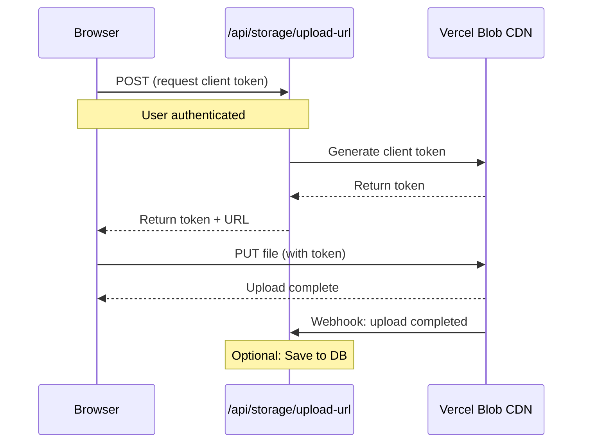

# File Storage Setup

> **Note**: This documentation was written by Claude 3.5 Sonnet.

This project supports **cloud-based file storage** for handling file uploads and downloads.

## Overview

Files are stored with **public access** by default, making them accessible via URL. This is useful for sharing uploaded content, displaying images, and integrating with external services.

## Storage Drivers

The project supports three storage backends:

- **Vercel Blob** - Default for all deployments (recommended)
- **S3** - For AWS/S3-compatible storage
- **MinIO** - For self-hosted S3-compatible storage

**Vercel Blob** is the default storage driver and works seamlessly in both local development and production environments.

## Configuration

### Environment Variables

```ini
# Storage driver selection (defaults to vercel-blob)
FILE_STORAGE_TYPE=vercel-blob # or s3, minio

# Optional: Subdirectory prefix for organizing files
FILE_STORAGE_PREFIX=uploads

# === Vercel Blob (FILE_STORAGE_TYPE=vercel-blob) ===
BLOB_READ_WRITE_TOKEN=<auto on Vercel>
VERCEL_BLOB_CALLBACK_URL= # Optional: For local webhook testing with ngrok

# === S3 (FILE_STORAGE_TYPE=s3) ===
FILE_STORAGE_S3_BUCKET=your-bucket
FILE_STORAGE_S3_REGION=us-east-1
AWS_ACCESS_KEY_ID=your-access-key
AWS_SECRET_ACCESS_KEY=your-secret-key
# Optional: FILE_STORAGE_S3_PUBLIC_BASE_URL=https://cdn.example.com
# Optional: FILE_STORAGE_S3_ENDPOINT=https://s3.amazonaws.com
# Optional: FILE_STORAGE_S3_FORCE_PATH_STYLE=1

# === MinIO (FILE_STORAGE_TYPE=minio) ===
MINIO_ENDPOINT=http://localhost:9000
MINIO_USER=minioadmin
MINIO_PASSWORD=minioadmin
MINIO_REGION=us-east-1
MINIO_USE_SSL=false
MINIO_BUCKET=uploads
MINIO_CONSOLE_ENDPOINT=http://192.168.1.7:9001
```

### Quick Start with Vercel Blob

Vercel Blob works in both local development and production environments:

1. Go to your Vercel project → **Storage** tab
2. Click **Connect Database** → **Blob** → **Continue**
3. Name it (e.g., "Files") and click **Create**
4. Pull environment variables locally:

```bash
vercel env pull
```

That's it! File uploads will now work seamlessly in both development and production.

## Client Upload

The `useFileUpload` hook **automatically selects the optimal upload method** based on your storage backend:

- **Vercel Blob**: Direct browser → CDN upload (fastest, default)
- **S3**: Presigned URL upload (when implemented)

```tsx
"use client";

import { useFileUpload } from "hooks/use-presigned-upload";

function FileUploadComponent() {
  const { upload, isUploading } = useFileUpload();

  const handleFileChange = async (e: React.ChangeEvent<HTMLInputElement>) => {
    const file = e.target.files?.[0];
    if (!file) return;

    const result = await upload(file);
    if (!result) return; // Upload failed (error shown via toast)

    // File uploaded successfully
    console.log("Public URL:", result.url);
    console.log("Pathname (key):", result.pathname);
  };

  return (
    <input type="file" onChange={handleFileChange} disabled={isUploading} />
  );
}
```

### Upload Flow

#### Vercel Blob (Direct Upload)



### Features

- ✅ **Cloud-Based Storage**: Vercel Blob provides globally distributed CDN
- ✅ **Works Everywhere**: Same storage in development and production
- ✅ **Direct Client Upload**: Browser uploads directly to CDN (fastest)
- ✅ **Public Access**: All files get public URLs
- ✅ **Authentication**: Users must be logged in to upload
- ✅ **Collision Prevention**: UUID-based file naming
- ✅ **Type Safety**: Full TypeScript support with unified interface

## Server-Side Upload

For server-side uploads (e.g., programmatically generated files):

```ts
import { serverFileStorage } from "lib/file-storage";

const result = await serverFileStorage.upload(buffer, {
  filename: "generated-image.png",
  contentType: "image/png",
});

console.log("Public URL:", result.sourceUrl);
```

## Upload Completion Webhook

The `/api/storage/upload-url` endpoint handles the `onUploadCompleted` webhook from Vercel Blob. You can add custom logic here:

```ts
// src/app/api/storage/upload-url/route.ts

onUploadCompleted: async ({ blob, tokenPayload }) => {
  const { userId } = JSON.parse(tokenPayload);

  // Save to database
  await db.files.create({
    url: blob.url,
    pathname: blob.pathname,
    userId,
    size: blob.size,
    contentType: blob.contentType,
  });

  // Send notification
  // await sendNotification(userId, "File uploaded!");
};
```

## Advanced

### Local Development with Vercel Blob Webhooks

To test Vercel Blob's `onUploadCompleted` webhook locally, use [ngrok](https://ngrok.com/):

```bash
# Terminal 1: Start your app
pnpm dev

# Terminal 2: Start ngrok
ngrok http 3000

# Add to .env.local
VERCEL_BLOB_CALLBACK_URL=https://abc123.ngrok-free.app
```

Without ngrok, uploads will work but `onUploadCompleted` won't be called locally.

### Custom Storage Backend

To implement a custom storage driver (e.g., Cloudflare R2):

1. Create a new file in `src/lib/file-storage/` (e.g., `r2-file-storage.ts`)
2. Implement the `FileStorage` interface from `file-storage.interface.ts`
3. Add your driver to `index.ts`
4. Update `FILE_STORAGE_TYPE` environment variable

The `FileStorage` interface provides:

- `upload()` - Server-side file upload
- `createUploadUrl()` - Generate presigned URL for client uploads (optional)
- `download()`, `delete()`, `exists()`, `getMetadata()`, `getSourceUrl()`

### Storage Comparison

| Feature              | Vercel Blob         | S3                 | MinIO              |
| -------------------- | ------------------- | ------------------ | ------------------ |
| Direct Client Upload | ✅ Yes              | ✅ Yes (presigned) | ✅ Yes (presigned) |
| CDN                  | ✅ Global           | Configurable       | Self-hosted        |
| Cost                 | Pay-as-you-go       | Pay-as-you-go      | Free (self-hosted) |
| Best For             | All deployments     | AWS ecosystem      | Self-hosted/Dev    |
| Setup Complexity     | Minimal             | Moderate           | Low                |
| Local Development    | ✅ Works with token | ✅ Works           | ✅ Works           |

## Why Not Local Filesystem?

Local filesystem storage is **not supported** because:

1. **AI APIs can't access localhost**: When AI APIs receive `http://localhost:3000/file.png`, they cannot fetch the file
2. **Serverless incompatibility**: Platforms like Vercel don't support persistent filesystem
3. **No CDN**: Files aren't globally distributed

**Solution**: Vercel Blob provides a free tier and works seamlessly in both local development and production. Simply run `vercel env pull` to get your token locally.
